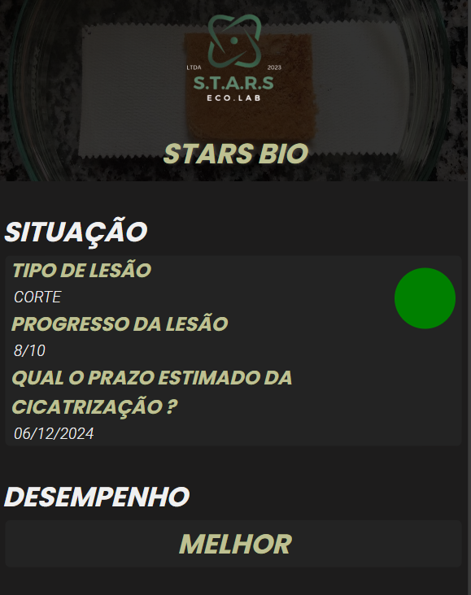

# STARS BIO 

  

> Este projeto foi desenvolvido em parceria com o curso de Administração da EEEP Leonel de Moura Brizola.

## ✅ Propostas 

- Mostrar o produto que seria o biocurativo 
- Trazer um exemplo de como seria o funcionamento do aplicativo com o biocurativo, com o usuário definindo as condições

## ⚙️ Ajustes e melhorias

- [x] Acrescentar responsividade

## 💻 Linguagens

## 📝 Liçencas 
<ul> 
  <li>Equipe Starbio <a href="https://www.instagram.com/starsbio.s?utm_source=ig_web_button_share_sheet&igsh=ZDNlZDc0MzIxNw==">Instagram </a> </li>
</ul>

